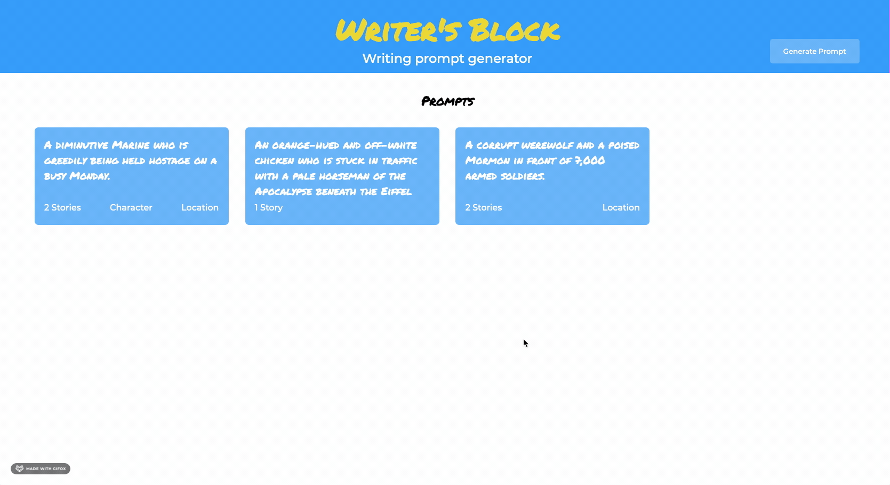
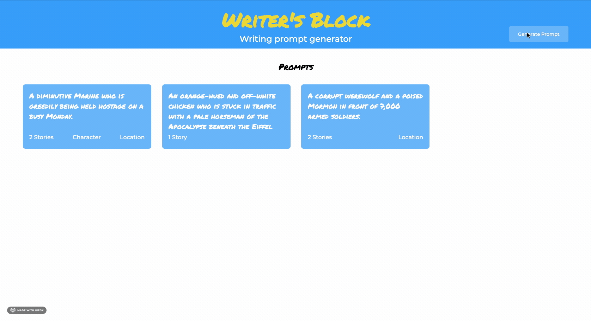
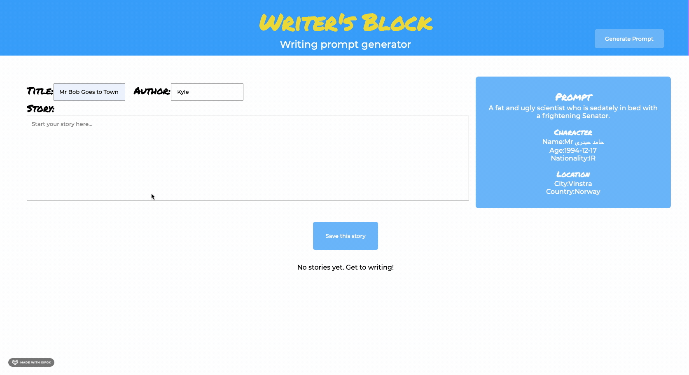

# Writer's Block

## Abstract

Writer's Block is an application for writers who want to practice and need inspiration.  A user is able to pick an existing prompt from a list or generate a new prompt to write about.  If the user needs more inspiration, they may also generate a character or location.  Users can generate prompts, write, and read stories by other users.  

Backend API: https://github.com/KyleWong2510/WritersBlockAPI

## Technologies Used

- React
- Express
- CSS
- React Testing Library
- Jest
- React Router
- Git

## Demo

<figure>

<figcaption>Navigating to the prompt page</figcaption>
</figure>

<figure>

<figcaption>Generating a new prompt</figcaption>
</figure>

<figure>

<figcaption>Writing and saving a story</figcaption>
</figure>

## Contributor

- [Kyle Wong](https://github.com/KyleWong2510)

## Future Iterations
- User login to view/edit stories they have written 
- Ability to up/down vote
- Ability to comment
- More helper prompts (random words, genre of story)
- Ability to add to a story from another user
- More robust backend to allow all data to persist
